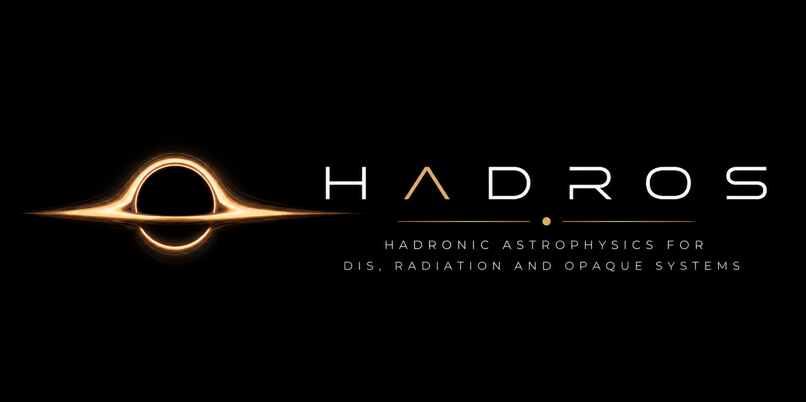

<p align="center">
  
</p>

# HADROS

**High-energy Astrophysical DIS Radiation and Observation Simulator**

HADROS combines Kerr ray tracing, DIS optical-depth calculations, and
radiative-transfer post-processing for controlled high-energy astrophysical
neutrino opacity studies.

## Density Background Framework

The current medium model uses semi-analytic density morphologies: controlled,
parameterized backgrounds for opacity studies. They are not hydrodynamical
simulations, realistic collapsar solutions, or equilibrium accretion flows.

Available profiles:

- `gaussian`
- `powerlaw`
- `gaussian_funnel`
- `powerlaw_funnel`
- `gaussian_envelope`
- `powerlaw_envelope`
- `powerlaw_funnel_envelope`
- `collapsar_ndaf_like`

All density profiles apply an explicit floor:

```text
rho = max(rho_raw, rho_floor)
```

Detailed definitions and validation notes are in
`docs/semi_analytic_density_backgrounds.md`.

## Safe Execution Workflow

The default `make` target prints available commands and does not launch
production runs.

Compile CPU validation binaries:

```bash
make build NTHREADS=2
```

Run a cheap CPU validation:

```bash
make validate_small NTHREADS=4
```

Run a tiny CPU/CUDA smoke test:

```bash
make validate_small_cuda NTHREADS=2 \
  NVCC=/home/rafael/micromamba/envs/dis/bin/nvcc \
  PYTHON=/home/rafael/micromamba/envs/dis/bin/python
```

Run the medium CPU/CUDA image validation:

```bash
make validate_medium_cuda NTHREADS=2 \
  NVCC=/home/rafael/micromamba/envs/dis/bin/nvcc \
  PYTHON=/home/rafael/micromamba/envs/dis/bin/python
```

Run production intentionally:

```bash
make run_production NTHREADS=4
```

If using make parallelism, keep it explicit and limited:

```bash
make -j2 build
```

## Thread Limiting

OpenMP runs are limited through:

```text
NTHREADS ?= 4
OMP_NUM_THREADS ?= $(NTHREADS)
```

Use `NTHREADS=2` or `NTHREADS=4` for validation runs. Do not rely on unlimited
CPU parallelism by default.

## Recovery Notes

The 2026-06-09 freeze/recovery record is in:

```text
README_RECOVERY_20260609.md
```

Do not use quarantined files for final plots or science diagnostics.

## Current Validation Status

- CPU implementation: validated.
- Gaussian backward compatibility: validated against the legacy Gaussian
  expression on a controlled cache.
- Density floor: implemented and verified for funnel profiles.
- Validation plots: generated for `gaussian`, `powerlaw`, `powerlaw_funnel`,
  and `powerlaw_funnel_envelope`.
- CUDA compilation: works with
  `/home/rafael/micromamba/envs/dis/bin/nvcc`.
- CUDA opacity/survival smoke test: passed at 8x8.
- CUDA image validation: passed at 32x32 with nonzero total intensity for
  `gaussian` and `powerlaw_funnel_envelope`.

Medium CUDA report:

```text
output/validation/cuda_cpu_comparison_medium.txt
```

The 32x32 CUDA validation is still below production resolution; rerun the same
comparison at science resolution before using GPU-generated production figures.

## DIS Model Validation

The DIS validation workflow freezes the astrophysical setup and varies only the
charged-current neutrino-nucleon cross-section table:

- `GBW`
- `IIM`
- `PDF_reference`

Run:

```bash
make validate_dis_models NTHREADS=2 PYTHON=python3
```

Outputs:

```text
output/dis_validation/dis_table_audit.md
output/dis_validation/sigma_model_comparison.csv
output/dis_validation/dis_observable_comparison.csv
output/dis_validation/dis_model_validation_summary.md
plots/dis_validation/
```

The local `PDF_reference` table is a documented literature-scale charged-current
reference curve for controlled comparison. It is not a full modern PDF
uncertainty band. Details are in:

```text
docs/dis_model_validation.md
```

## UHE Source Prescriptions

The UHE emissivity is now selected with:

```text
SOURCE_MODEL
```

Available phenomenological UHE source prescriptions:

- `inner_ring`
- `funnel_wall`
- `jet_base`
- `shock_layer` / density-gradient source
- `density_weighted`

These are controlled source morphologies for opacity studies. They are not
realistic particle-acceleration calculations, first-principles cosmic-ray
transport, or self-consistent jet physics.

Source diagnostics:

```bash
make validate_source_plots
```

Detailed definitions are in:

```text
docs/uhe_source_models_design.md
```

## UHE Spectral Models

The UHE emissivity is factorized as:

```text
source morphology x spectral model
```

Available spectral models:

- `monochromatic`
- `powerlaw`
- `powerlaw_cutoff`

The default is backward-compatible:

```text
SPECTRAL_MODEL ?= monochromatic
```

Useful parameters:

```text
SPECTRAL_GAMMA
SPECTRAL_ECUT_GEV
SPECTRAL_E_MIN_GEV
SPECTRAL_E_MAX_GEV
SPECTRAL_N_BINS
```

Example:

```bash
make image-from-small-cache \
  SPECTRAL_MODEL=powerlaw_cutoff \
  SPECTRAL_GAMMA=2.0 \
  SPECTRAL_ECUT_GEV=1e12 \
  SPECTRAL_N_BINS=8 \
  NTHREADS=2
```

Validation:

```bash
make validate_spectra NTHREADS=2 PYTHON=python3
```

Outputs:

```text
output/spectra/
plots/spectra/
```

Energy-band composite image:

```bash
make plot_multiband_image \
  SPECTRAL_MODEL=powerlaw_cutoff \
  SPECTRAL_E_MIN_GEV=1e5 \
  SPECTRAL_E_MAX_GEV=1e12 \
  SPECTRAL_N_BINS=8 \
  NTHREADS=2
```

This product uses false colors for UHE neutrino energy intervals:

```text
blue  = low-energy UHE band, 1e5-1e7 GeV
green = intermediate-energy UHE band, 1e7-1e10 GeV
red   = high-energy UHE band, 1e10-1e12 GeV
```

The colors encode energy bands, not physical photon colors.

Details:

```text
docs/uhe_spectral_models.md
```

## Thermal MeV Neutrino Module

The MeV channel is separate from the UHE/DIS opacity module. It uses
low-energy weak-interaction physics in post-processing, not DIS cross sections.
The CPU MeV module is the canonical reference implementation.

Available MeV models:

- `physical`: approximate URCA, pair-annihilation, bremsstrahlung, absorption,
  and scattering channels.
- `toy`: previous phenomenological emissivity retained for comparison.

Diagnostic thermodynamic backgrounds:

```text
MEV_THERMAL_PROFILE=constant|inner_hot_torus|radial_powerlaw|torus_plus_cool_envelope|collapsar_inner_hot
MEV_YE_PROFILE=constant|neutron_rich_torus|funnel_proton_rich|torus_envelope_contrast|collapsar_neutron_rich
```

These are semi-analytic diagnostic fields for morphology tests. They are not
hydrodynamic thermodynamic solutions and are not calibrated absolute luminosity
predictions.

MeV spectral modes:

```text
MEV_SPECTRAL_MODE=monochromatic
MEV_SPECTRAL_MODE=fermi_dirac_band
```

The band mode uses `MEV_E_MIN_MEV`, `MEV_E_MAX_MEV`, and `MEV_N_BINS` with a
Fermi-Dirac-like weight for diagnostic energy-band images.

Next-generation diagnostic MeV options:

```text
MEV_USE_DEGENERACY_CORRECTION=0|1
MEV_INCLUDE_ABS_N=1
MEV_INCLUDE_ABS_P=1
MEV_INCLUDE_SCAT_N=1
MEV_INCLUDE_SCAT_P=1
MEV_INCLUDE_SCAT_E=1
```

`MEV_USE_DEGENERACY_CORRECTION` is off by default because it uses an approximate
zero-temperature electron chemical-potential diagnostic. The correction is
bounded and only modifies URCA-like emissivity when explicitly enabled.

Safe defaults:

```text
MEV_MODEL=physical
MEV_FLAVOR=anti_nu_e
MEV_ENERGY_MEV=10
MEV_INCLUDE_URCA=1
MEV_INCLUDE_PAIR=1
MEV_INCLUDE_BREMS=1
MEV_INCLUDE_ABSORPTION=1
MEV_INCLUDE_SCATTERING=1
MEV_THERMAL_PROFILE=inner_hot_torus
MEV_YE_PROFILE=neutron_rich_torus
MEV_SPECTRAL_MODE=monochromatic
MEV_USE_DEGENERACY_CORRECTION=0
```

Run the MeV validation:

```bash
make validate_mev_physics NTHREADS=2 PYTHON=python3
```

Outputs:

```text
output/validation/mev_physics_validation.txt
plots/mev_physics/
```

Key validation plots:

```text
plots/mev_physics/mev_emissivity_channels.png
plots/mev_physics/mev_opacity_vs_energy.png
plots/mev_physics/mev_channel_dominance_map.png
plots/mev_physics/mev_flavor_comparison.png
plots/mev_physics/mev_transfer_limits.png
plots/mev_physics/mev_image_physical_vs_toy.png
```

Run the diagnostic MeV energy-band composite image:

```bash
make mev_multiband_image NTHREADS=2 PYTHON=python3
```

Outputs:

```text
plots/mev_physics/mev_multiband_false_color_image.png
output/mev_neutrinosphere/mev_multiband_flux.csv
```

False colors encode neutrino energy intervals:

```text
blue  = low-energy MeV band, 3-8 MeV
green = intermediate-energy MeV band, 8-20 MeV
red   = high-energy MeV band, 20-50 MeV
```

Run diagnostic MeV optical-depth surfaces:

```bash
make mev_neutrinosphere PYTHON=python3
```

Outputs:

```text
output/validation/mev_realism_upgrade_validation.txt
output/mev_neutrinosphere/mev_tau_surface_tau067_E10MeV.dat
plots/mev_physics/mev_neutrinosphere_tau067.png
plots/mev_physics/mev_neutrinosphere_energy_dependence.png
plots/mev_physics/mev_tau_phase_diagram.png
plots/mev_physics/mev_vs_uhe_opacity_surfaces.png
```

Run the next-generation MeV diagnostics:

```bash
make validate_mev_degeneracy PYTHON=python3
make validate_mev_opacity_components PYTHON=python3
make mev_luminosity NTHREADS=2 PYTHON=python3
make validate_mev_upgrades NTHREADS=2 PYTHON=python3
```

Audit the current MeV luminosity proxy:

```bash
make audit_mev_luminosity NTHREADS=2 PYTHON=python3
```

Audit the physical regime represented by the current torus:

```bash
make audit_torus_regime NTHREADS=2 PYTHON=python3
```

Compare the named weakly cooled and collapsar/NDAF-like regimes:

```bash
make audit_collapsar_ndaf_like PYTHON=python3
```

Regime names used in comparisons:

```text
fiducial_uhe_default
```

Historical UHE opacity fiducial. It uses the low-density UHE background,
`rho0 = 1e-2 g/cm3`, and should be used when comparing against the original UHE
opacity-surface scale.

```text
fiducial_mev_density
```

Weakly neutrino-cooled MeV luminosity-audit fiducial. It uses the same Gaussian
morphology but `rho0 = 1e10 g/cm3`, so it is not interchangeable with
`fiducial_uhe_default`.

```text
collapsar_ndaf_like
```

Literature-guided semi-analytic collapsar/NDAF-like preset with larger mass,
higher density, hotter inner disk, and neutron-rich torus. It is still a
post-processing morphology, not a hydrodynamical simulation.

Outputs:

```text
output/validation/mev_degeneracy_validation.txt
output/validation/mev_opacity_components_validation.txt
output/validation/mev_luminosity_validation.txt
output/mev_luminosity/mev_luminosity_summary.csv
output/mev_luminosity/mev_luminosity_summary.md
output/mev_luminosity/luminosity_budget.csv
output/mev_luminosity/luminosity_budget.md
output/mev_luminosity/unit_audit.md
output/mev_luminosity/realism_gap_analysis.md
output/mev_luminosity/audit_summary.md
output/torus_regime/current_model_statistics.md
output/torus_regime/torus_mass_estimate.md
output/torus_regime/regime_recommendations.md
output/torus_regime/realistic_parameter_targets.md
output/torus_regime/torus_regime_summary.md
output/collapsar_ndaf_like/collapsar_statistics.md
output/collapsar_ndaf_like/collapsar_mass_estimate.md
output/collapsar_ndaf_like/comparison_summary.md
output/collapsar_ndaf_like/uhe_opacity_unit_audit.md
output/collapsar_ndaf_like/fiducial_mev_density_statistics.md
plots/mev_physics/mev_electron_degeneracy_map.png
plots/mev_physics/mev_eta_vs_density_temperature.png
plots/mev_physics/mev_opacity_components_vs_energy.png
plots/mev_physics/mev_opacity_components_rhoT_map.png
plots/mev_physics/mev_luminosity_vs_temperature.png
plots/mev_physics/mev_luminosity_vs_density.png
plots/mev_physics/mev_luminosity_channel_breakdown.png
plots/mev_physics/emitting_volume_contribution.png
plots/mev_physics/emissivity_weighted_temperature_distribution.png
plots/mev_physics/emissivity_weighted_density_distribution.png
plots/mev_physics/luminosity_vs_rho0.png
plots/mev_physics/luminosity_vs_temperature.png
plots/mev_physics/luminosity_vs_Ye.png
plots/torus_regime/rho_profiles_vs_literature.png
plots/torus_regime/T_profiles_vs_literature.png
plots/torus_regime/Ye_profiles_vs_literature.png
plots/collapsar_ndaf_like/mev_luminosity_comparison.png
plots/collapsar_ndaf_like/uhe_opacity_comparison.png
plots/collapsar_ndaf_like/neutrinosphere_comparison.png
```

Example image run with the physical MeV model:

```bash
make image-from-small-cache \
  MEV_MODEL=physical \
  MEV_FLAVOR=anti_nu_e \
  MEV_ENERGY_MEV=10 \
  NTHREADS=2
```

This is a post-processing MeV neutrino transport model. It is not full neutrino
radiation hydrodynamics and should not be used to claim calibrated absolute
neutrino luminosities without additional calibration. The CPU post-processing
path uses the physical MeV module; the CUDA MeV kernel still uses the previous
toy/leakage implementation and requires a separate future update/validation.
CPU image metadata records `MEV_CPU_MODEL`; CUDA MeV status is
`legacy_toy_not_equivalent`.

Details:

```text
docs/mev_neutrino_physics.md
docs/mev_diagnostic_workflow.md
```

## Plot Dashboard

Generate a static HTML dashboard that indexes existing plots and output
products without running simulations:

```bash
make dashboard PYTHON=python3
```

Outputs:

```text
dashboard/index.html
dashboard/plot_manifest.json
```

Open `dashboard/index.html` in a browser. The dashboard groups plots into Kerr
images, density backgrounds, UHE source morphologies, robustness scans, opacity
surfaces, spectral models, MeV neutrino physics, and ParaView exports. The
manifest records filename, category, relative path, description, known command,
and creation time when available.

Details:

```text
docs/plot_dashboard.md
```

## Robustness Scans

Point 3 scans test whether qualitative opacity conclusions survive changes in
source model, density morphology, energy, viewing angle, spin, and source
parameters.

Run the validation-scale scan suite:

```bash
make robustness_scans NTHREADS=2 \
  PYTHON=/home/rafael/micromamba/envs/dis/bin/python
```

Outputs:

```text
output/scans/scan_summary.csv
output/scans/scan_summary.md
plots/scans/
```

The scan framework uses moderate resolution and is intended for robustness
arguments, not production-resolution convergence.

## Opacity Surfaces

Point 4 extracts UHE opacity surfaces `r_tau(theta)` from radial outward DIS
optical depth. The standard products include `tau=2/3`, `tau=1`, and `tau=3`.

Run:

```bash
make opacity_surfaces TAU_SURFACE_VALUE=1.0 \
  PYTHON=/home/rafael/micromamba/envs/dis/bin/python
```

Outputs:

```text
output/opacity_surfaces/
plots/opacity_surfaces/
output/opacity_surfaces/paraview/
```

Key figures:

```text
plots/opacity_surfaces/tau_surface_comparison.png
plots/opacity_surfaces/energy_dependence_tau_surface.png
plots/opacity_surfaces/opacity_phase_diagram.png
plots/opacity_surfaces/p_surv_energy_theta.png
plots/opacity_surfaces/source_independence_test.png
```

The implementation is currently axisymmetric and diagnostic. It is designed so
that a future `r_tau(theta,phi)` extraction can be added later. The module also
exports extracted opacity surfaces as ParaView-readable VTK PolyData files, but
it does not fake volumetric tau fields.

Details:

```text
docs/opacity_surfaces.md
```

## ParaView Export

The target below exports the current axisymmetric semi-analytic model to a
3D Cartesian legacy VTK file readable by ParaView:

```bash
make paraview_fields \
  DENSITY_PROFILE=powerlaw_funnel_envelope \
  SOURCE_MODEL=funnel_wall \
  PARAVIEW_NX=64 PARAVIEW_NY=64 PARAVIEW_NZ=64 \
  PARAVIEW_BOX_RG=80 \
  NTHREADS=4
```

Output:

```text
output/paraview/bh_torus_fields.vtk
```

Exported scalar fields:

- `density_gcm3`
- `log10_density`
- `uhe_emissivity`
- `log10_uhe_emissivity`
- `r_rg`
- `theta`
- `phi`
- `normalized_source`

This is a 3D Cartesian sampling of an axisymmetric semi-analytic model, not a
fully 3D hydrodynamical simulation. Optical depth is not exported as a local
scalar field because it requires a line-of-sight or radial integration
convention.

Details:

```text
docs/paraview_export.md
```
