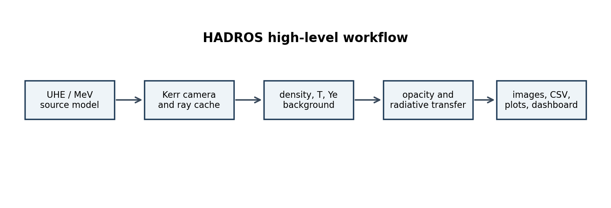
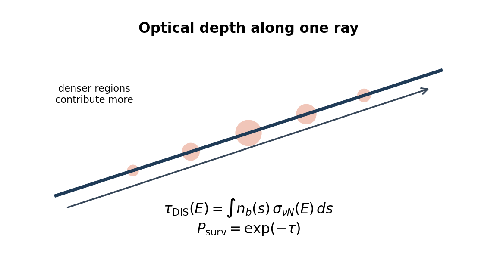
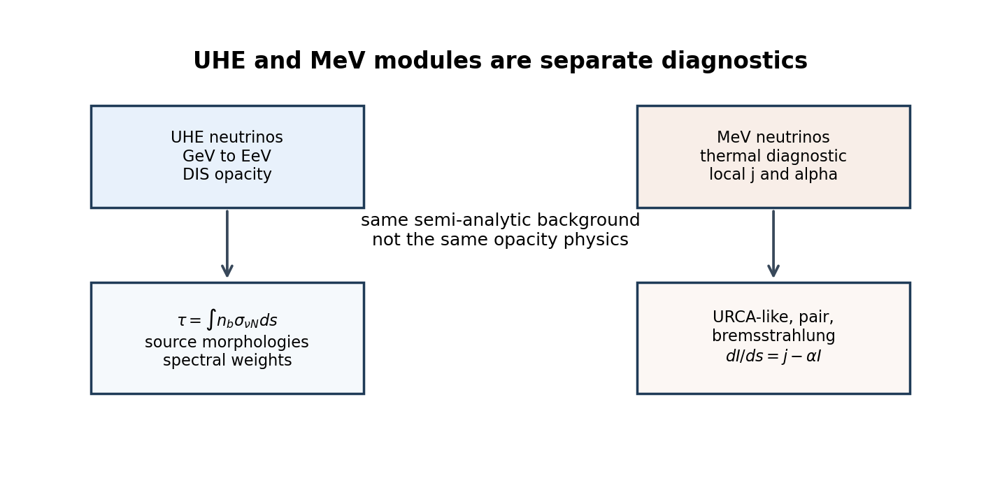
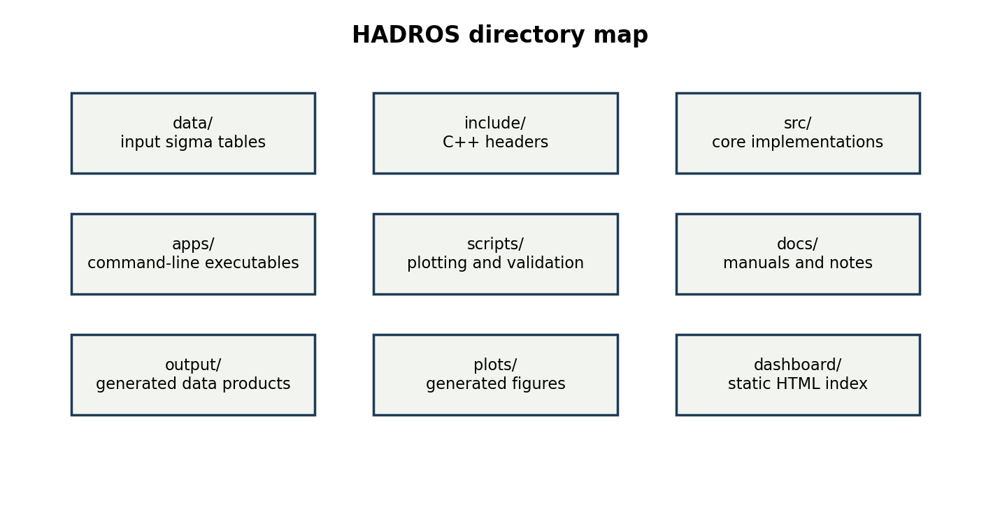

# HADROS User Manual

High-energy Astrophysical DIS Radiation and Observation Simulator

This manual is written for students and new users. It explains first the
physical ideas behind HADROS, then the main commands, and only after that the
internal program flow. HADROS is a research code for controlled opacity studies,
so the manual is careful about what the code can and cannot claim.



## 1. Overview

HADROS combines Kerr ray tracing, semi-analytic astrophysical backgrounds, UHE
neutrino DIS opacity, phenomenological source and spectral prescriptions,
diagnostic MeV neutrino post-processing, ParaView export, and a static dashboard
for organizing plots.

At a high level the pipeline is:

```text
source prescription
  -> Kerr ray tracing
  -> density / temperature / Ye background
  -> opacity and radiative transfer
  -> images, plots, CSV tables, dashboard
```

HADROS does not perform hydrodynamic evolution. It is not full neutrino
radiation hydrodynamics, not a calibrated collapsar simulation, and not a
complete PDF-uncertainty package. The current backgrounds are semi-analytic
density morphologies, the UHE sources are phenomenological prescriptions, and
the MeV luminosities are diagnostic proxies.

## 2. Physical Theories

### 2.1 Kerr ray tracing

The spacetime around a rotating black hole is modeled with the Kerr metric. The
main physical parameters are the black-hole mass `MBH_MSUN` and the
dimensionless spin `ASPIN`. The observer is placed at a large radius
`CAM_R_OBS_RG` and inclination `CAM_THETA_DEG`. The camera launches rays
backward through the Kerr geometry and stores geodesics in a cache.

For neutrinos in the UHE range, the rest mass is negligible compared with the
energy, so the propagation is approximated by null geodesics:

```text
ds^2 = 0
```

The ray path is therefore controlled by the Kerr geometry. The energy
dependence in UHE images mostly enters through opacity,
`sigma_nuN(E)`, not through chromatic lensing. In other words, a low-energy and
high-energy neutrino see essentially the same null geodesic, but not the same
survival probability.

The code works in gravitational-radius units,

```text
r_g = G M_BH / c^2
```

so distances such as source radius, torus radius, observer radius, and camera
step are usually expressed in units of `r_g`. This is convenient because a
Kerr problem with the same dimensionless spin and the same dimensionless
geometry has the same ray shape when measured in `r_g`. The black-hole mass
then enters when converting path length into centimeters for physical opacity
integrals.

Spin matters because Kerr spacetime is not just a Schwarzschild geometry with a
different horizon. Frame dragging changes how rays bend near the black hole,
and the horizon radius depends on spin. For a dimensionless spin `a`, the
outer horizon in geometric units is

```text
r_+ = 1 + sqrt(1 - a^2)
```

in units where `G = M = c = 1`. HADROS does not infer the spin from a
self-consistent accretion solution; the spin is a controlled input parameter.

The ray tracing is best understood as a mapping from camera pixels to paths
through the source environment. A pixel near the black-hole shadow corresponds
to a ray that passed close to the horizon or was captured. A pixel away from
the shadow samples more direct paths through the torus and funnel. HADROS uses
this mapping to ask: along this path, how much matter did the neutrino cross,
and how much emission accumulated before attenuation?

#### 2.1.1 Equations actually solved by HADROS

The Kerr module is implemented in:

```text
include/kerr_metric.hpp
src/kerr_metric.cpp
include/kerr_geodesic.hpp
src/kerr_geodesic.cpp
include/kerr_camera.hpp
src/kerr_camera.cpp
```

The metric is the Kerr metric in Boyer-Lindquist coordinates
`(t, r, theta, phi)` with signature `(-,+,+,+)` and dimensionless units
`G = M = c = 1`. The code defines

```text
Sigma = r^2 + a^2 cos^2(theta)
Delta = r^2 - 2 r + a^2
A = (r^2 + a^2)^2 - a^2 Delta sin^2(theta)
```

The nonzero covariant metric components used by HADROS are:

```text
g_tt       = -(1 - 2 r / Sigma)
g_tphi     = -2 a r sin^2(theta) / Sigma
g_rr       = Sigma / Delta
g_thetatheta = Sigma
g_phiphi   = [r^2 + a^2 + 2 a^2 r sin^2(theta)/Sigma] sin^2(theta)
```

The inverse metric used by the Hamiltonian system is:

```text
g^tt     = -A / (Sigma Delta)
g^tphi   = -2 a r / (Sigma Delta)
g^rr     = Delta / Sigma
g^thetatheta = 1 / Sigma
g^phiphi = (Delta - a^2 sin^2(theta)) /
           (Sigma Delta sin^2(theta))
```

Null geodesics are integrated in Hamiltonian form. The state vector is

```text
y = (t, r, theta, phi, p_t, p_r, p_theta, p_phi)
```

where the momenta are covariant momenta. The Hamiltonian is

```text
H = 1/2 g^{mu nu} p_mu p_nu
```

and a null ray should satisfy `H = 0` up to numerical error. The canonical
equations used in the code are:

```text
dx^mu / dlambda = partial H / partial p_mu
                 = g^{mu nu} p_nu

dp_mu / dlambda = - partial H / partial x^mu
                 = -1/2 partial_mu(g^{alpha beta}) p_alpha p_beta
```

Because the Kerr metric is stationary and axisymmetric, the code sets

```text
dp_t / dlambda = 0
dp_phi / dlambda = 0
```

and evolves only `p_r` and `p_theta` through metric derivatives. In the current
implementation, derivatives of the inverse metric are computed by centered
finite differences:

```text
partial_r g^{mu nu} approx
  [g^{mu nu}(r + eps, theta) - g^{mu nu}(r - eps, theta)] / (2 eps)

partial_theta g^{mu nu} approx
  [g^{mu nu}(r, theta + eps) - g^{mu nu}(r, theta - eps)] / (2 eps)
```

with `eps = 1e-5 max(1, |r|)` for the radial derivative and `eps = 1e-5` for
the angular derivative.

The camera initializes each pixel using a local ZAMO/LNRF-like tetrad
approximation at the observer. Pixel coordinates are converted to angular
camera coordinates

```text
u = [2(i+0.5)/Nx - 1] tan(FOV/2)
v = [2(j+0.5)/Ny - 1] tan(FOV/2)
norm = sqrt(1 + u^2 + v^2)
```

and the local backward ray direction is

```text
n_r     = -1 / norm
n_theta =  v / norm
n_phi   =  u / norm
```

This local direction is converted into Boyer-Lindquist contravariant momentum
components using the ZAMO lapse `alpha`, frame-dragging angular velocity
`omega`, and spatial metric components:

```text
p^t     = 1 / alpha
p^r     = n_r / sqrt(g_rr)
p^theta = n_theta / sqrt(g_thetatheta)
p^phi   = n_phi / sqrt(g_phiphi) + omega p^t
```

Then the code lowers the index with `p_mu = g_mu nu p^nu` and integrates the
Hamiltonian system.

#### 2.1.2 Numerical integration method

The production geodesic stepper is an adaptive Runge-Kutta-Fehlberg 4(5)
method. In the code this is `KerrGeodesic::step_adaptive`. It computes both a
fourth-order estimate `y4` and a fifth-order estimate `y5` using the classic
Fehlberg coefficients:

```text
k1 = f(y)
k2 = f(y + h k1/4)
k3 = f(y + h[3 k1/32 + 9 k2/32])
k4 = f(y + h[1932 k1/2197 - 7200 k2/2197 + 7296 k3/2197])
k5 = f(y + h[439 k1/216 - 8 k2 + 3680 k3/513 - 845 k4/4104])
k6 = f(y + h[-8 k1/27 + 2 k2 - 3544 k3/2565
              + 1859 k4/4104 - 11 k5/40])
```

The local error estimate is the maximum absolute difference between selected
components of `y4` and `y5`:

```text
err = max(|r4-r5|, |theta4-theta5|, |phi4-phi5|,
          |pr4-pr5|, |ptheta4-ptheta5|, |pphi4-pphi5|)
```

If `err < tolerance`, the fifth-order estimate is accepted. If the error is too
large, the step is retried with a smaller step size. The update factor is

```text
factor = 0.8 [tolerance / max(err, 1e-30)]^(1/4)
```

clamped between `0.1` and `5.0`. The minimum internal step is `h_min = 1e-5 h`.
If the adaptive routine fails after 50 attempts, the code falls back to a fixed
fourth-order Runge-Kutta step, `step_rk4`.

The ray stops when either:

```text
r <= r_horizon + 1e-3
```

in which case it is marked as captured, or

```text
r >= r_max
```

after the initial transient, in which case the ray is considered to have left
the computational domain. A hard limit of `200000` steps prevents accidental
infinite integrations.

For each accepted path point, HADROS stores:

```text
r_rg, theta, x_rg, y_rg, z_rg, dl_rg, redshift_factor
```

The spatial interval `dl_rg` is estimated from the spatial Boyer-Lindquist
metric components at the midpoint between consecutive stored points. This
stored path is later reused by the opacity and radiative-transfer routines.

Concretely, for two consecutive states `previous` and `current`, HADROS first
defines the midpoint

```text
r_mid     = 0.5 (r_current + r_previous)
theta_mid = 0.5 (theta_current + theta_previous)
```

and evaluates the Kerr metric at `(r_mid, theta_mid)`. Then it computes

```text
dr     = r_current     - r_previous
dtheta = theta_current - theta_previous
dphi   = wrapped(phi_current - phi_previous)
```

where `wrapped` maps the azimuthal difference into the interval `[-pi, pi]` so
that a ray crossing `phi = pi` does not produce an artificial jump of nearly
`2 pi`.

The stored spatial step is then

```text
dl_rg = sqrt(max(dl2, 0))

dl2 = g_rr(r_mid,theta_mid) dr^2
    + g_thetatheta(r_mid,theta_mid) dtheta^2
    + g_phiphi(r_mid,theta_mid) dphi^2
```

In code notation this is exactly:

```text
dl2 = g[1][1] * dr * dr
    + g[2][2] * dtheta * dtheta
    + g[3][3] * dphi * dphi
```

This `dl_rg` is a local spatial distance in units of `r_g`. Later, opacity
routines convert it to centimeters using the black-hole mass:

```text
dl_cm = dl_rg * r_g
```

This is not the affine-parameter step `dlambda`. It is the local spatial path
length used to approximate column-density integrals such as
`integral n_b sigma ds`.

### 2.2 Semi-analytic density backgrounds

The matter field is a controlled semi-analytic background, not a hydrodynamic
solution. Available density profiles include:

- `gaussian`
- `powerlaw`
- `gaussian_funnel`
- `powerlaw_funnel`
- `gaussian_envelope`
- `powerlaw_envelope`
- `powerlaw_funnel_envelope`
- `collapsar_ndaf_like`

Every profile applies an explicit density floor:

```text
rho = max(rho_raw, rho_floor)
```

This prevents numerical zero-density funnels from becoming artificially
transparent.

The profiles are deliberately simple enough to scan. A Gaussian torus is useful
as a control because most of the mass is concentrated around a radius `r0` and
falls off smoothly. A power-law torus is useful when one wants an extended
radial column. Funnel variants reduce density near the polar axis, mimicking
the qualitative fact that jet funnels are lower density than the equatorial
disk. Envelope variants add an outer collapsar-like component, useful for
testing whether large-radius material contributes significantly to UHE
attenuation.

These profiles should be read as morphology, not dynamics. There is no pressure
balance equation, no angular-momentum transport, no self-consistent heating,
and no hydrodynamic time evolution. That is a limitation, but it is also what
makes the model useful for controlled experiments: changing one parameter can
be interpreted as changing a column-density geometry rather than changing a
full simulation with many coupled effects.

The thermodynamic quantities used by the MeV module are also parameterized.
Temperature and electron fraction are not evolved by the code. They are
profiles used for post-processing diagnostics. This distinction matters: a
MeV luminosity computed from a semi-analytic temperature field is a diagnostic
consequence of that assumed field, not a prediction from a self-consistent disk
simulation.

| Regime | Purpose | Typical density | Interpretation | Limitation |
|---|---|---:|---|---|
| `fiducial_uhe_default` | UHE opacity baseline | low, often near `1e-2 g cm^-3` in validation examples | transparent controlled test background | not a collapsar disk |
| `fiducial_mev_density` | MeV diagnostic baseline | around `1e9-1e10 g cm^-3` in audits | weakly neutrino-cooled compact torus | low luminosity is expected |
| `collapsar_ndaf_like` | literature-guided high-density preset | significant regions near `1e10-1e12 g cm^-3` | semi-analytic NDAF/collapsar-like thermodynamic regime | not hydrodynamics and not tuned to a target luminosity |

### 2.3 UHE neutrino DIS opacity

The UHE optical depth is computed from the baryon column along a ray:

```text
tau_DIS(E) = integral n_b(s) sigma_nuN(E) ds
P_surv(E) = exp[-tau_DIS(E)]
```

Here `n_b` is the baryon number density and `sigma_nuN(E)` is the neutrino
nucleon DIS cross section. HADROS currently compares:

- `GBW`, a saturation-inspired DIS model table;
- `IIM`, another small-x saturation-inspired model table;
- `CTW_reference`, the central `nu N` charged-current table from Connolly,
  Thorne & Waters, Phys. Rev. D 83, 113009, Table I;
- `literature_powerlaw_scale`, an older approximate scale curve retained only
  for comparison.

`CTW_reference` is charged-current `nu N` only. It does not include neutral
current interactions, antineutrino tables, regeneration, or PDF uncertainty
bands.

The opacity integral has a simple physical structure:

```text
number of targets crossed  x  interaction probability per target
```

The target column is controlled by the astrophysical model through `n_b ds`.
The interaction probability is controlled by the particle physics through
`sigma_nuN(E)`. This separation is one of the main reasons HADROS is useful:
the same ray cache and density field can be post-processed with different DIS
tables.

The survival probability is exponential, so small and large optical depths
behave very differently. If `tau << 1`, the medium is optically thin and

```text
P_surv approx 1 - tau
```

so differences between DIS models appear as small brightness changes. If
`tau >> 1`, the medium is opaque and all models may produce nearly zero
observed intensity, even when their absolute `tau` values differ by large
factors. This is why the manual and validation reports distinguish between
`mean_tau` and `total_intensity`: one can still compare optical depths after
the image has saturated to black.

At UHE energies the relevant nucleon structure is probed at very small Bjorken
`x`. GBW and IIM are saturation-inspired small-`x` models. CTW is a
Standard-Model PDF-based reference using MSTW 2008 PDFs. HADROS does not decide
which description is correct. It propagates the consequences of each table
through the same astrophysical setup, making the model dependence visible.

Current limitations are important. Neutral-current scattering can reduce
energy without fully absorbing the neutrino; regeneration can repopulate lower
energies; antineutrino cross sections differ from neutrino cross sections; PDF
uncertainty bands matter at the highest energies. These effects are not yet
included in the current validation pipeline.



### 2.4 UHE source morphologies

The UHE emissivity is separated into a source morphology and a spectral model.
The source morphologies are phenomenological:

- `inner_ring`: compact equatorial inner-ring baseline;
- `funnel_wall`: emission near the boundary of the low-density funnel;
- `jet_base`: compact source near the axis and small radii;
- `shock_layer` or density-gradient source: emission where density gradients
  are large;
- `density_weighted`: distributed source with
  `j_UHE proportional to rho^q r^-s`.

These models are not first-principles particle acceleration simulations. They
are controlled prescriptions for testing how source placement changes the
observed opacity maps.

The source morphology affects where neutrinos are injected, not how the medium
attenuates them. This distinction is essential. If neutrinos are injected deep
inside the equatorial torus, many rays cross large baryonic columns before
reaching the observer. If they are injected near the funnel wall, some rays can
escape through lower-density angular regions. If they are injected near the jet
base, the image may emphasize the polar geometry and black-hole lensing.

The `shock_layer` model should be interpreted as a density-gradient proxy. It
does not solve shock acceleration. It simply weights emission toward regions
where the semi-analytic density changes rapidly, which is a plausible place to
test interface-driven emission scenarios. The `density_weighted` model is
similarly phenomenological: it asks what happens if production traces dense
matter through a factor like `rho^q r^-s`.

### 2.5 UHE spectral models

The UHE spectral interface currently supports:

```text
monochromatic
powerlaw
powerlaw_cutoff
```

The power-law spectrum is

```text
dN/dE proportional to E^-gamma
```

and the cutoff power law is

```text
dN/dE proportional to E^-gamma exp(-E/Ecut)
```

The default remains `SPECTRAL_MODEL=monochromatic` for backward compatibility.
Energy-band composite images use false colors: blue for the low-energy UHE
band, green for the intermediate band, and red for the high-energy band. These
colors encode energy intervals; they are not physical photon colors.

Spectral integration changes the meaning of an image. A monochromatic image
answers: what would the sky look like if all neutrinos had one energy? A
spectral image answers: what is the weighted result after many energies are
emitted and attenuated differently? Because `sigma_nuN(E)` grows with energy,
the high-energy part of a spectrum can be suppressed more strongly than the
low-energy part. Thus the observed spectrum is generally softer than the
emitted spectrum when the medium is not fully transparent.

The spectral interface is intentionally generic. The transport code asks for a
spectral weight as a function of energy; it should not care whether that weight
came from a power law, broken power law, log-parabola, thermal distribution, or
future tabulated spectrum. This keeps the astrophysical transport pipeline
separate from the source-spectrum model.

### 2.6 Optical-depth surfaces

HADROS can extract diagnostic opacity surfaces such as:

```text
tau = 2/3
tau = 1
tau = 3
```

These surfaces are properties of the medium, geometry, neutrino energy, and DIS
cross section. They do not depend on the UHE source morphology. The current
implementation is axisymmetric and extracts `r_tau(theta)`. It is designed so a
future `r_tau(theta, phi)` extension can be added for true 3D backgrounds.

Opacity surfaces are analogous in spirit to photospheres, but they should be
used carefully. A surface `tau = 1` does not mean neutrinos are emitted there.
It means that, according to the chosen optical-depth convention, material
inside that surface is significantly attenuating. For UHE neutrinos this is a
DIS opacity surface, not a thermal neutrinosphere.

Because an opacity surface is a property of the medium, it should not change
when one switches from `inner_ring` to `funnel_wall` or `jet_base`, provided
the density, geometry, energy, and cross section are unchanged. This is a key
validation check in HADROS. Source models can change image brightness and
where emission appears, but they should not change `r_tau(theta)`.

The current extraction is radial and axisymmetric. That means it is most useful
for comparing density backgrounds, energies, and cross-section choices. A true
observer-dependent optical depth along camera geodesics is already used in
images, but that is not the same object as a simple radial opacity surface.

### 2.7 Thermal MeV neutrino module

The MeV module is separate from UHE/DIS. It is a diagnostic local emissivity and
radiative-transfer model, not a calibrated absolute luminosity prediction.

Implemented channels include URCA-like processes:

```text
e- + p -> n + nu_e
e+ + n -> p + anti_nu_e
```

pair annihilation:

```text
e- + e+ -> nu + anti-nu
```

and nucleon-nucleon bremsstrahlung:

```text
N + N -> N + N + nu + anti-nu
```

The MeV opacity includes absorption and scattering proxies with approximate
energy scaling like `sigma ~ E_MeV^2`. The local transfer equation is:

```text
dI/ds = j - alpha I
```

where `j` is emissivity and `alpha` is opacity. CPU MeV is the canonical
physical reference implementation. CUDA MeV remains legacy/toy until it is
ported and validated.

The MeV module lives in a different physical regime from the UHE module. MeV
neutrino emission is thermal or weak-interaction emission from hot dense
matter. UHE neutrino attenuation is DIS scattering on baryons at vastly higher
energies. They can be evaluated on the same background, but they should not be
mixed conceptually.

Temperature is especially important. Pair emission has a steep approximate
temperature dependence, often summarized as a high power such as `T^9` in
simple scaling arguments. URCA-like channels also rise rapidly with
temperature and depend on density and electron fraction. Therefore a torus with
`T ~ 4 MeV` can be orders of magnitude dimmer in MeV neutrinos than a torus
with `T ~ 15 MeV`, even if the geometry looks similar.

Electron fraction `Ye` controls the relative abundance of neutrons and protons.
That matters for charged-current absorption and for differences between
`nu_e`, `anti_nu_e`, and heavy-lepton flavors grouped as `nu_x`. In the current
approximation, `nu_x` does not have the same charged-current absorption as
electron-flavor neutrinos.

The transfer equation has a useful limiting behavior. If `alpha ds` is very
small, the optically thin update is approximately

```text
I_out approx I_in + j ds
```

If `alpha ds` is very large, the intensity approaches the local source
function:

```text
I_out -> j / alpha
```

The validation suite checks these limits for the CPU MeV module.



### 2.8 MeV diagnostic upgrades

The MeV diagnostic workflow includes temperature profiles, electron-fraction
profiles, Fermi-Dirac-like spectral integration, MeV neutrinosphere extraction
at `tau_MeV = 2/3`, electron-degeneracy diagnostics, opacity-component
decomposition, and luminosity-proxy audits.

Luminosities from this module should be described as diagnostic proxy values
unless a separate calibration against literature or simulations is performed.

### 2.9 ParaView and 3D visualization

The ParaView export samples the current axisymmetric semi-analytic model onto a
3D Cartesian grid. It can export density, log-density, UHE emissivity,
log-emissivity, radius, polar angle, azimuth, and normalized source morphology.

This is a 3D Cartesian sampling of an axisymmetric model. It is not a fully 3D
hydrodynamical simulation. HADROS does not export a fake local tau field;
opacity requires a line-of-sight or radial integration convention.

## 3. Main Makefile Commands

### 3.1 Safe build and validation

Show available targets:

```bash
make
```

Compile CPU binaries:

```bash
make build NTHREADS=2
```

Run a cheap CPU validation:

```bash
make validate_small NTHREADS=2
```

Run a tiny CPU/CUDA smoke test:

```bash
make validate_small_cuda NTHREADS=2 \
  NVCC=/home/rafael/micromamba/envs/dis/bin/nvcc \
  PYTHON=/home/rafael/micromamba/envs/dis/bin/python
```

Run the medium CPU/CUDA validation:

```bash
make validate_medium_cuda NTHREADS=2 \
  NVCC=/home/rafael/micromamba/envs/dis/bin/nvcc \
  PYTHON=/home/rafael/micromamba/envs/dis/bin/python
```

### 3.2 Running images

Monochromatic UHE image using a cache:

```bash
make image-from-cache ENU=1e11 DENSITY_PROFILE=gaussian NTHREADS=2
```

Spectral UHE image:

```bash
make image-from-cache SPECTRAL_MODEL=powerlaw \
  SPECTRAL_GAMMA=2.0 SPECTRAL_E_MIN_GEV=1e5 \
  SPECTRAL_E_MAX_GEV=1e12 SPECTRAL_N_BINS=8 NTHREADS=2
```

Energy-band composite UHE image:

```bash
make plot_multiband_image PYTHON=python3
```

MeV physical image:

```bash
make image-from-cache MEV_MODEL=physical MEV_FLAVOR=anti_nu_e NTHREADS=2
```

MeV multiband image:

```bash
make mev_multiband_image NTHREADS=2 PYTHON=python3
```

### 3.3 Running robustness scans

```bash
make robustness_scans NTHREADS=2 PYTHON=python3
```

Outputs go to `output/scans/` and `plots/scans/`.

### 3.4 DIS validation

```bash
make validate_dis_models NTHREADS=2 PYTHON=python3
```

This compares GBW, IIM, `literature_powerlaw_scale`, and `CTW_reference`.
Outputs go to `output/dis_validation/` and `plots/dis_validation/`.

### 3.5 Opacity surfaces

```bash
make opacity_surfaces TAU_SURFACE_VALUE=1.0 PYTHON=python3
```

Outputs go to `output/opacity_surfaces/` and `plots/opacity_surfaces/`.

### 3.6 MeV diagnostics

```bash
make validate_mev_physics PYTHON=python3
make mev_neutrinosphere PYTHON=python3
make mev_luminosity PYTHON=python3
make audit_mev_luminosity PYTHON=python3
make audit_torus_regime PYTHON=python3
make audit_collapsar_ndaf_like PYTHON=python3
```

### 3.7 ParaView export

```bash
make paraview_fields \
  DENSITY_PROFILE=powerlaw_funnel_envelope \
  SOURCE_MODEL=funnel_wall \
  PARAVIEW_NX=64 PARAVIEW_NY=64 PARAVIEW_NZ=64 \
  PARAVIEW_BOX_RG=80 NTHREADS=4
```

Output:

```text
output/paraview/bh_torus_fields.vtk
```

### 3.8 Dashboard

```bash
make dashboard PYTHON=python3
```

Open:

```text
dashboard/index.html
```

The dashboard indexes existing plots and output products. It does not run
simulations.

### 3.9 Thread control

HADROS defaults to safe thread use:

```text
NTHREADS ?= 4
OMP_NUM_THREADS ?= $(NTHREADS)
```

Use explicit limits:

```bash
make -j2 build
make validate_small NTHREADS=2
make run_production NTHREADS=4
```

Production runs are explicit. The default `make` target prints help and does
not launch a full simulation.

## 4. Outputs and Directory Map



- `data/`: input data tables, especially DIS sigma tables.
- `include/`: C++ headers.
- `src/`: core C++ implementations.
- `apps/`: command-line applications built by the Makefile.
- `scripts/`: plotting, validation, and audit scripts.
- `docs/`: manuals and scientific notes.
- `plots/`: generated figures.
- `output/`: generated tables, images, ray caches, and validation reports.
- `dashboard/`: static HTML dashboard.

Common places to look:

- Images: `output/images/`
- Plot figures: `plots/`
- DIS reports: `output/dis_validation/`
- MeV reports: `output/validation/`, `output/mev_luminosity/`,
  `output/mev_neutrinosphere/`
- ParaView files: `output/paraview/`
- Dashboard: `dashboard/index.html`

## 5. Program Workflow

The internal workflow is:

1. Choose a physical setup: density profile, source model, spectrum, observer,
   spin, and energy.
2. Generate or load a Kerr ray cache.
3. Evaluate the local background along each ray.
4. Compute local UHE and/or MeV emissivity.
5. Compute opacity.
6. Integrate radiative transfer along rays.
7. Write data tables.
8. Generate plots.
9. Index products in the dashboard.

```text
Makefile variables
  -> executable arguments
  -> C++ model objects
  -> ray-by-ray integration
  -> output/*.dat and output/*.csv
  -> scripts/*.py plots
  -> dashboard/index.html
```

## 6. Recommended Workflows for Students

### Beginner: run dashboard only

```bash
make dashboard PYTHON=python3
```

Open `dashboard/index.html` and explore existing products.

### Beginner: run small validation

```bash
make validate_small NTHREADS=2 PYTHON=python3
```

This checks that the code compiles, creates a small ray cache, and runs a cheap
image calculation.

### Intermediate: compare DIS models

```bash
make validate_dis_models NTHREADS=2 PYTHON=python3
```

Read `output/dis_validation/dis_model_validation_summary.md`.

### Intermediate: generate MeV diagnostic plots

```bash
make validate_mev_physics PYTHON=python3
```

Then inspect `plots/mev_physics/`.

### Advanced: create collapsar_ndaf_like comparison

```bash
make audit_collapsar_ndaf_like PYTHON=python3
```

This compares the baseline and literature-guided semi-analytic preset without
changing the physics modules.

### Advanced: export to ParaView

```bash
make paraview_fields DENSITY_PROFILE=collapsar_ndaf_like NTHREADS=4
```

Open `output/paraview/bh_torus_fields.vtk` in ParaView.

## 7. Scientific Limitations

- Backgrounds are semi-analytic, not hydrodynamic evolutions.
- HADROS does not solve full neutrino radiation hydrodynamics.
- The MeV luminosities are proxy/diagnostic quantities, not calibrated
  absolute predictions.
- CUDA MeV remains legacy/toy and is not equivalent to CPU physical MeV.
- `CTW_reference` is central charged-current `nu N` only.
- UHE neutral-current interactions and regeneration are not yet included.
- There is no true 3D hydrodynamic background yet.
- ParaView export samples axisymmetric fields into 3D; it does not create a
  fully 3D simulation.

## 8. Troubleshooting

If `make` seems to run too long, stop the process and use a validation target
with smaller resolution, such as `validate_small`.

If CPU usage is too high, pass `NTHREADS=2` or `NTHREADS=4`, and use limited
make parallelism such as `make -j2 build`.

If CUDA is not found, check:

```bash
which nvcc
nvcc --version
nvidia-smi
```

Then pass the explicit `NVCC` path if needed.

If plots are missing, regenerate the relevant plotting target, then rebuild the
dashboard with `make dashboard PYTHON=python3`.

If stale caches are suspected after a crash, do not trust old ray or image
caches automatically. See `README_RECOVERY_20260609.md`.

If `NaN` or `Inf` appears in outputs, check density floors, energy ranges, and
whether the requested energy is inside the sigma-table range.

If output files become huge, avoid production targets and use validation
resolutions first.

## 9. Glossary

DIS: deep inelastic scattering, the high-energy neutrino-nucleon interaction
used for UHE opacity.

UHE: ultra-high energy, here referring to GeV-to-EeV scale neutrinos.

MeV: mega-electronvolt; thermal neutrino energies in compact-object disks are
often in the MeV range.

Optical depth: dimensionless attenuation measure, `tau`.

Survival probability: `P_surv = exp(-tau)`.

Neutrinosphere: diagnostic surface where optical depth reaches a chosen value,
often `tau = 2/3`.

Kerr metric: spacetime geometry around a rotating black hole.

Ray tracing: integration of camera rays or geodesics through spacetime.

NDAF: neutrino-dominated accretion flow.

Collapsar: massive-star collapse scenario that can form a black hole and dense
accretion environment.

Emissivity: local production rate of radiation or neutrinos.

Opacity: local attenuation coefficient or interaction strength.

CTW: Connolly, Thorne & Waters; HADROS uses their central `nu N` CC table as a
published reference.

GBW: Golec-Biernat-Wusthoff saturation-inspired DIS model.

IIM: Iancu-Itakura-Munier saturation-inspired DIS model.
